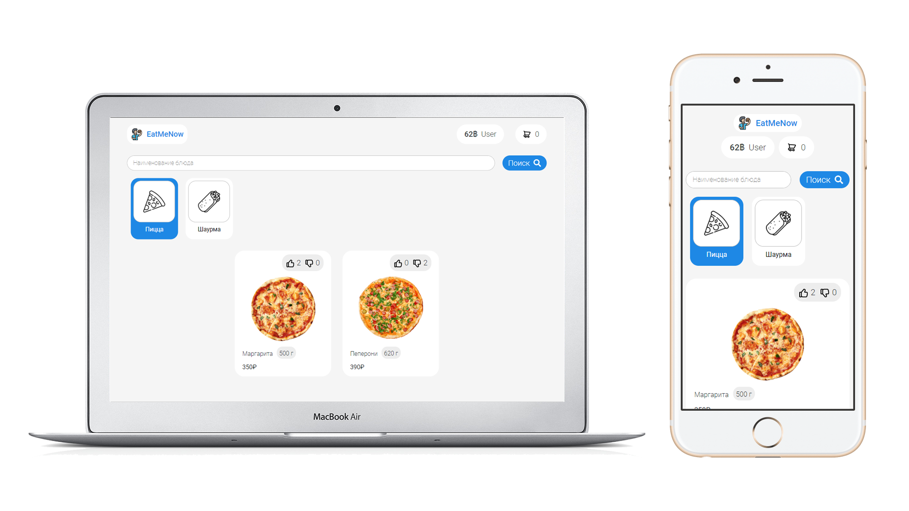

**Restaurant Online** is a service for automize restaurant or cafe duties.



# Key features

* Navigate in restaurant dish menu
* Making orders, approve it and notify users
* Creating personal account (self-register, oauth2) with bonuses bill
* Admin-area which includes creating/editing/deleting categories and dishes, approving orders, checking statistics

## Admin menu
* Menu editing


* Orders approving


* Orders statistics


# Design
All proptotypes and ui kit available in official [figma page](https://www.figma.com/file/RBc3R2My9PXcYdI5QJE90q/EatMeNow?node-id=1%3A2).

# Building
## Back-end
For building back-end you need to use this commands:
```bash
./mvnw package
```

After package you can run bundle from `./modules/app/target`.

But before runnig you must deploy database or use another database server.
For deploying database with help of docker and docker-compose use:
```bash
docker-compose up
```

Compose create container with MYSQL database, which is ready for connection.

For run server:
```bash
cd ./modules/app/target
java -jar bundle-name.jar
```

After start server will apply database migrations based on [Liquibase](https://www.liquibase.org/).

## Front-end
For building front-end you need to pull submodules and then use this commands:
```bash
cd ./ui
npm i
npm run build
```

After building front-end part will be bundled in `./ui/build` directory.

# Modules

Application includes 6 main modules:
* `Analytics` - provides statistics in cut of orders count and dish emotions
* `Auth` - provides authenticate and authorize features
* `Core` - share general features and utils accross all modules
* `Menu` - provices access to dish menu and ability to edit it
* `Orders` - responsible for orders process, which includes: make and approve order, calclulate bonunses and create transactions
